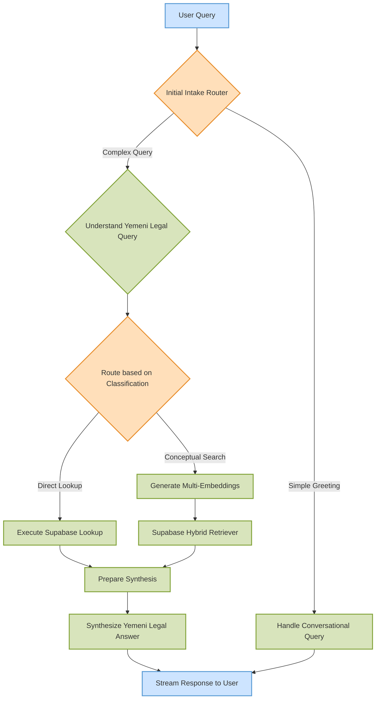

# المستشار (AlMustashar): An Advanced Legal RAG Agent for Yemeni Law


**AlMustashar** is a state-of-the-art, production-ready Retrieval Augmented Generation (RAG) agent engineered to navigate the complexities of Yemeni law. It provides precise, context-aware, and verifiable legal analysis in Arabic, setting a new standard for legal AI in the region.

## Why AlMustashar? The Challenge and The Solution

Navigating legal frameworks, especially in a specialized domain like Yemeni law, presents significant challenges:

*   **Language Nuance:** Arabic legal terminology is complex and context-dependent.
*   **Information Overload:** Sifting through vast legal corpora to find the exact relevant article is inefficient and prone to error.
*   **Hallucination Risk:** Standard LLMs often "hallucinate" or invent legal clauses, a critical failure in a legal context.

AlMustashar addresses these challenges head-on by employing a sophisticated, multi-layered agentic architecture. It doesn't just find information; it *understands* user intent, *strategizes* the best retrieval path, and *synthesizes* accurate, cited answers, effectively acting as a skilled legal research assistant.

## Architectural Highlights

This project demonstrates a deep understanding of modern AI engineering principles and production-grade system design.

1.  **Stateful, Agentic Workflow with LangGraph:** Instead of a simple, linear RAG chain, AlMustashar uses LangGraph to create a dynamic, stateful graph. This allows the agent to make decisions, route queries based on their nature (e.g., direct lookup vs. conceptual search), and handle complex, multi-step reasoning, mirroring a human research process.
2.  **Persona-Driven, Configurable Architecture:** The system is not one-size-fits-all. It supports multiple, configurable "personas" (e.g., `المستشار`, `الذكي`) that dynamically alter the underlying retrieval strategies and model parameters, allowing for optimized performance based on the query's context or user's needs.
3.  **Robust Hybrid Retrieval System:** AlMustashar implements a powerful hybrid search strategy, combining the precision of keyword-based, relational lookups in Supabase with the contextual power of semantic vector search using state-of-the-art Arabic-native embedding models (Matryoshka).
4.  **Production-Ready LLM Operations with Portkey:** All interactions with Large Language Models are managed through Portkey, an AI gateway. This demonstrates best practices for building scalable and reliable AI systems, providing essential features like intelligent load balancing, automatic model fallbacks, and centralized API key management.

## High-Level System Architecture

The following diagram illustrates the agent's core decision-making and data flow from receiving a user query to generating a final, synthesized response.



## Core Features

*   **Sophisticated Natural Language Understanding (NLU):** Classifies user queries to determine intent (e.g., conversational, direct lookup, conceptual search) and extracts key legal entities.
*   **Dynamic, Persona-Based Retrieval:** Adapts its retrieval strategy based on configurable agent personas, optimizing for different types of legal inquiries.
*   **Real-time Streaming with Citations:** Delivers answers via Server-Sent Events (SSE) and intelligently parses the generated text to link claims back to the correct source documents.
*   **Dedicated Indexing Pipeline:** Employs a separate, asynchronous LangGraph workflow for indexing legal documents, ensuring the knowledge base can be updated efficiently without disrupting the main query API.

## Technology Stack

The technology stack was carefully chosen to build a robust, scalable, and maintainable AI system.

*   **Core Frameworks & Language:**
    *   **Python:** The universal language for AI/ML development.
    *   **FastAPI:** For building high-performance, asynchronous, and production-ready APIs.
    *   **LangGraph:** The core orchestration engine, chosen for its power in creating complex, stateful, and agentic AI workflows.

*   **AI & Machine Learning:**
    *   **LLMs (Google Gemini):** Leveraged for its powerful reasoning and generation capabilities, especially with Arabic.
    *   **Embedding Models (Matryoshka, BGE-M3):** Custom-integrated, state-of-the-art models chosen for their superior performance on Arabic text, crucial for effective semantic retrieval.

*   **Databases & Data Infrastructure:**
    *   **Supabase (PostgreSQL):** Serves as a powerful and scalable backend for both relational data (legal articles, metadata, chat history) and as a vector store for hybrid search.
    *   **Pinecone:** (Planned/Available) An alternative, dedicated vector database for high-scale semantic search.

*   **DevOps & Tooling:**
    *   **Portkey:** An essential AI gateway for managing LLM API calls, providing observability, reliability (retries, fallbacks), and scalability (load balancing).
    *   **Uvicorn:** A lightning-fast ASGI server for running the FastAPI application.

## Getting Started

Instructions for setting up and running the project locally.

### Prerequisites

*   Python 3.9+
*   `pip` and `uvicorn`
*   Access to Google Gemini, Supabase, and Portkey APIs.

### 1. Clone the Repository

```bash
git clone https://github.com/your-repo/al-mustashar.git # Replace with actual repo URL
cd al-mustashar
```

### 2. Configure Environment

Create a `.env` file from the `.env.example` template and populate it with your API keys and service URLs.

### 3. Install Dependencies

```bash
pip install -e .
```

### 4. Run the API Server

```bash
uvicorn src.almustashar_api.main:app --host 0.0.0.0 --port 8000 --reload
```

The API will be available at `http://localhost:8000`.

## API Endpoints

*   **`GET /`**: Health check.
*   **`GET /rag/query`**: Execute a RAG query via GET request (streaming response).
*   **`POST /rag/chat-query`**: Execute a RAG query via POST request (streaming response).

## Project Structure

*   `src/almustashar_api/`: FastAPI application, routers, and API models.
*   `src/retrieval_graph/`: The core LangGraph definition for the RAG agent.
*   `src/index_graph/`: The LangGraph definition for the document indexing pipeline.
*   `src/custom_nodes/`: Modular, reusable nodes that define the agent's capabilities (e.g., query understanding, retrieval).
*   `src/custom_providers/`: Custom integrations for LLMs and embedding models.
*   `scripts/`: Utility and database processing scripts.
*   `memory-bank/`: Project documentation and architectural notes.

## License

This project is licensed under the [LICENSE file name, e.g., MIT License].
